# MiniSky Workflow Diagrams

## System Architecture

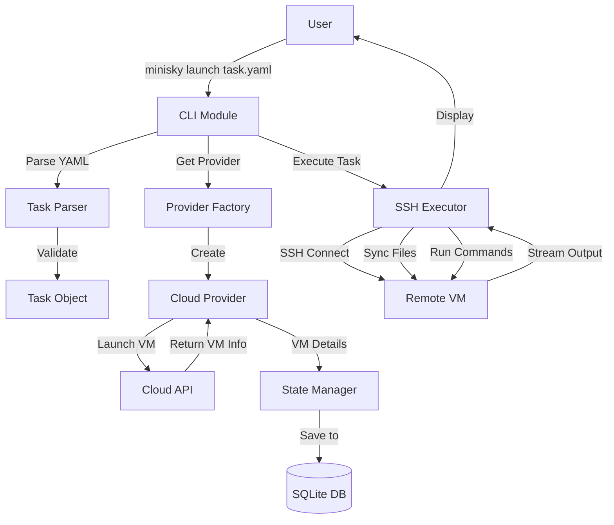

## Launch Command Flow

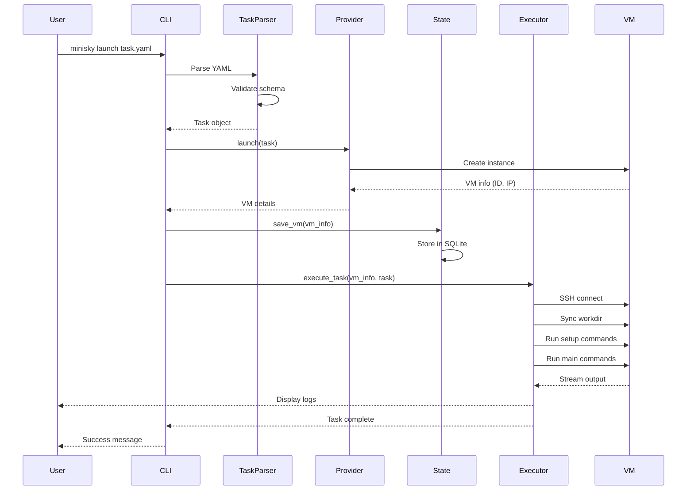

## Status Command Flow

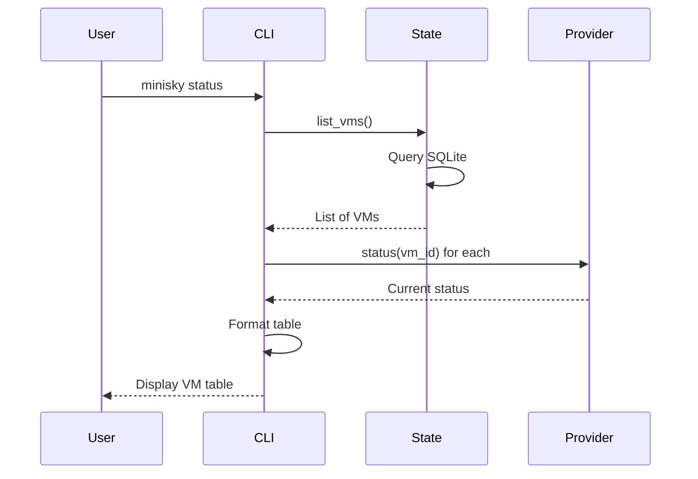

## Terminate Command Flow

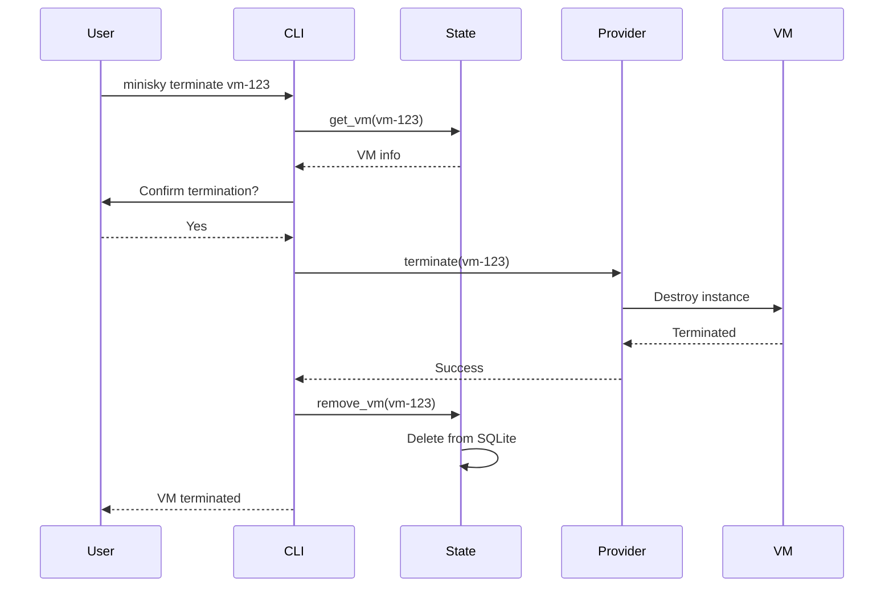

## Module Dependencies

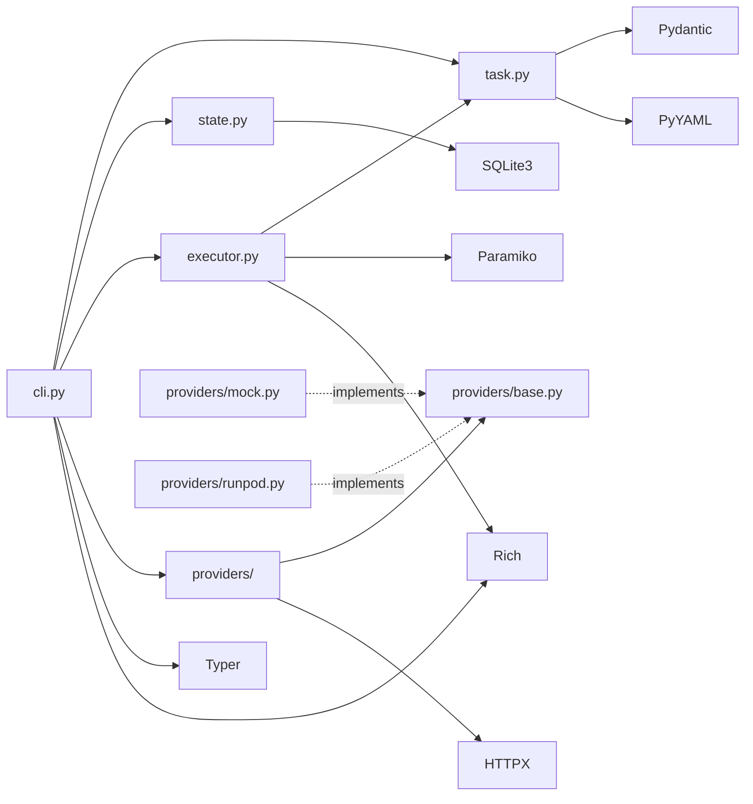

## Development Phases

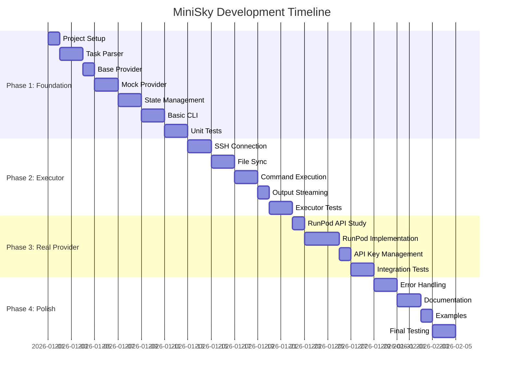

## Data Flow: Task Execution

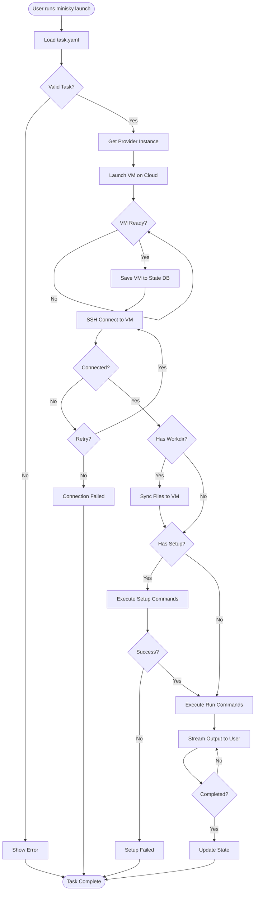

## Provider Interface Pattern

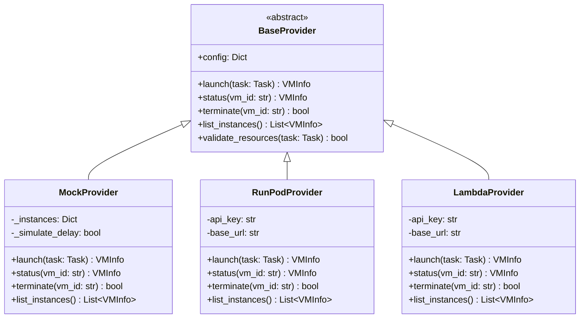

## State Management Schema

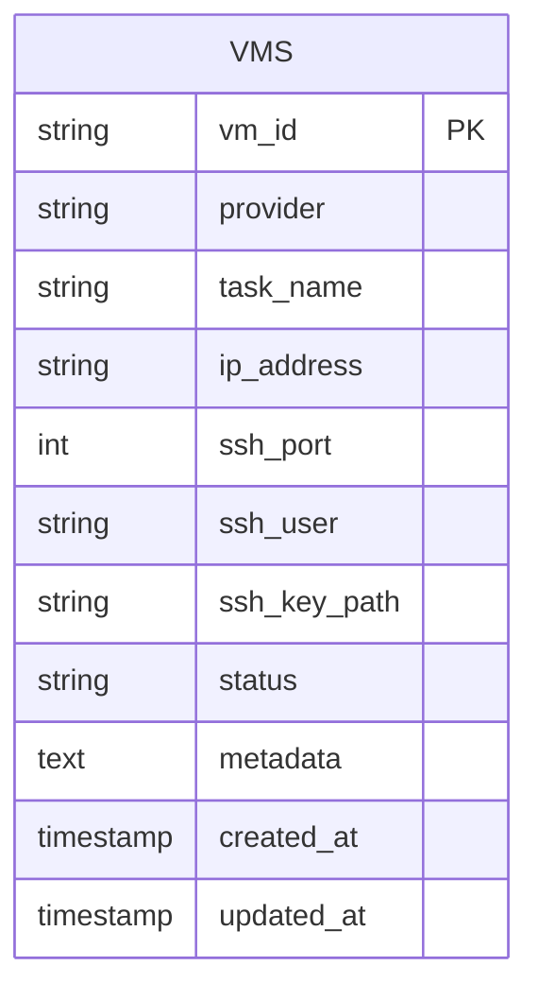

## Task YAML Structure

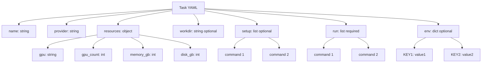

## Error Handling Flow

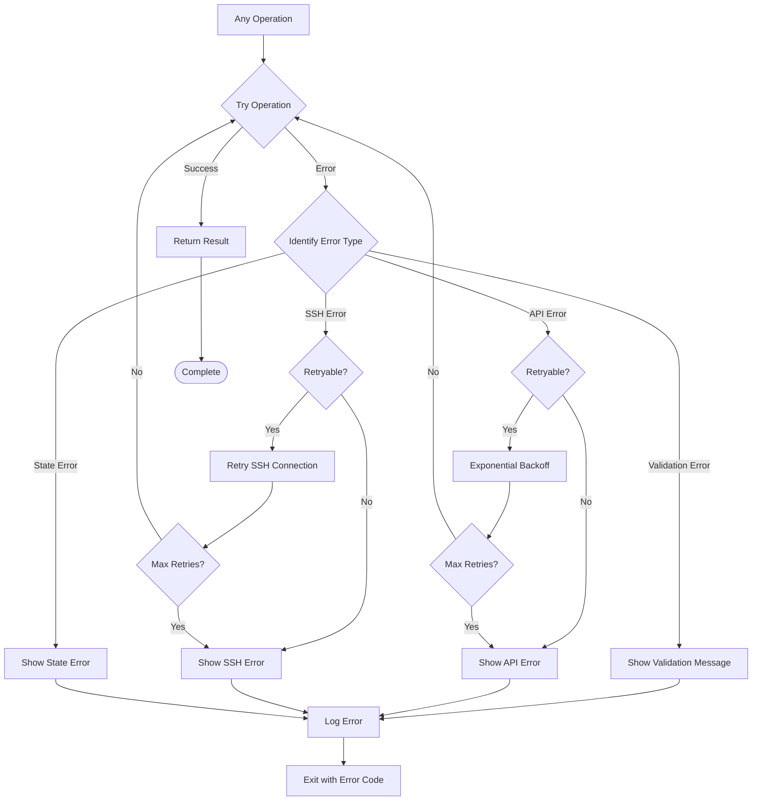

## Testing Strategy

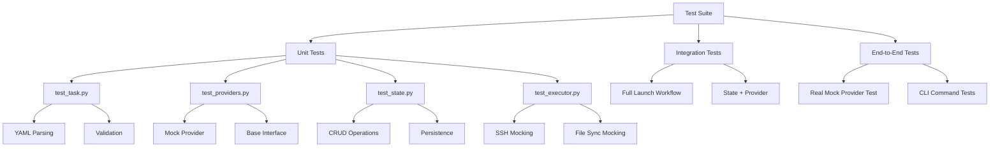

These diagrams provide a comprehensive visual overview of the MiniSky architecture, workflows, and development plan.
